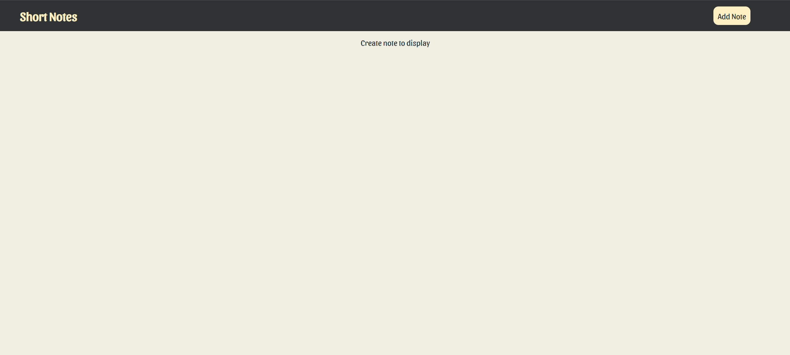
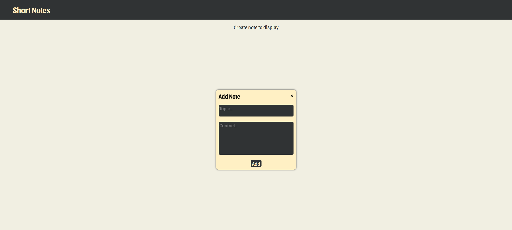
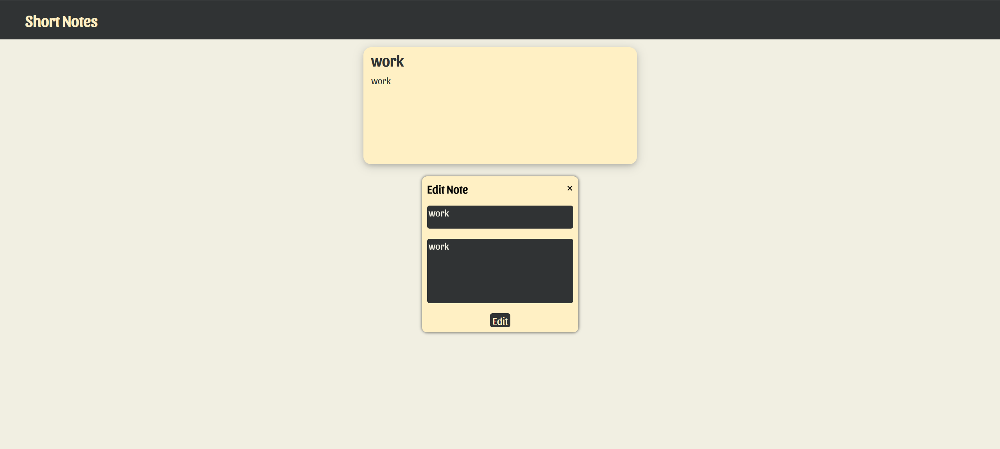
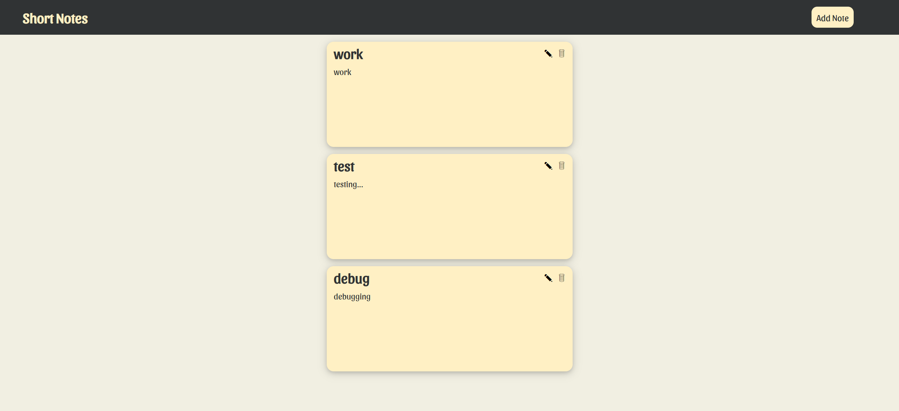

# Short Notes App

<a href="https://short-notes-ssk.netlify.app/">Visit</a>

A website to store short notes.

Tech Stack: `ReactJS` `Redux` `Redux Toolkit` `Redux Persist` `Vite`

Operations: `Add` `Edit` `Delete`

## HomePage

## Adding Note

## Editing Note

Editable options are pre-populated with existing values.

Created notes are stored in local storage using `redux-persist`.

## Dependencies

npm i react-redux @reduxjs/toolkit redux-persist
